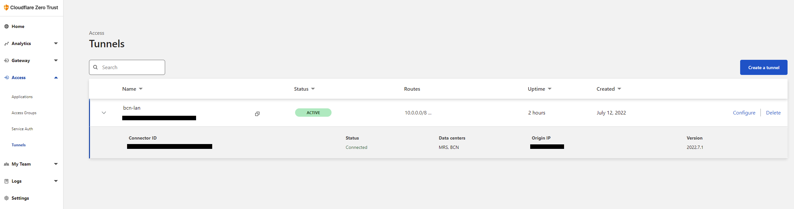
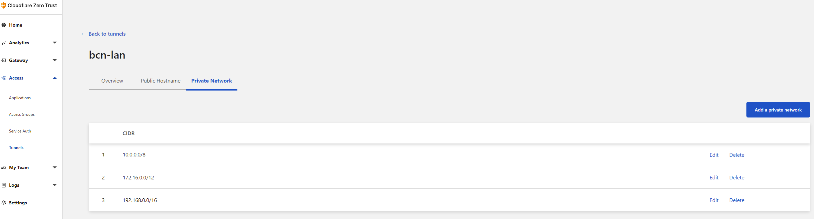

## Intro

Sooner or later, any worthy homelab will need to be accessed remotely. At the end of the day your homelab is like your personal cloud provider, where you might be hosting a plethora of services (virtualized or containerized) hosting things such webservers, media servers, storage servers, game servers, etc... So why limiting yourself to only being able to access those when you are at home? Maybe you go on holidays and want to watch something from your movie collection, or you want to backup your holiday pictures as soon as you take them to your NAS at home. The use cases are many.

There are many approaches on how to access remote resources running at home. Usual suspects in the homelab community are [OpenVPN](https://openvpn.net/) and more recently [Wireguard](https://www.wireguard.com/) and its derivatives: [Tailscale](https://tailscale.com/), [Zerotier](https://www.zerotier.com/) and [Cloudflared](https://developers.cloudflare.com/cloudflare-one/connections/connect-apps/).

After trying all of them except Zerotier (didn't have the time), I can say that I was greatly surprised by [Cloudflared](https://developers.cloudflare.com/cloudflare-one/connections/connect-apps/). It required very little setup compared to OpenVPN or Wireguard, and it can tunnel entire networks (ala VPN) as well as specific services (ala Reverse Proxy), all with the extra benefit of:

- **working behind CG-NAT**
- **no need for dynamic DNS**
- **no need to open a single port in your firewall**

All the above is possible because the connection is started within your network and not from outside (Tailscale is similar in this regard). In addition it integrates with Cloudflare's portfolio of security oriented services called [Zero Trust Network Access](https://www.cloudflare.com/products/zero-trust/zero-trust-network-access/), providing an enterprise grade secure access solution for free (as long as you stay within their generous limits, which most homelabs should fall into)

## Prerequisites

I'm assuming you already went through the Cloudflared docs and created your first tunnel using the web GUI option. If you did, then you have a tunnel and a *cloudflared* command to start your tunnel. The only interesting part for us in the generated command is the token, so copy that to your clipboard.

I'm also assuming that you have an [OpenWRT](https://github.com/openwrt/openwrt) device. In my case I use a -recently discontinued- ZyXEL Armor Z2 (aka [ZyXEL NBG6817](https://openwrt.org/toh/zyxel/nbg6817)) which I bought used for cheap (only $60) on ebay a few years back. It's currently flashed with OpenWRT 19.07 (update is due soon). Hardware specs are pretty decent and uses a 32bit ARM processor.

**NOTE:** You can also setup your tunnels from the command line but the process is a little more elaborated. The CLI method relies on a *cert.pem* and a *<<UUID>>.json* for tunnel creation and authentication, as well as having a *config.yml* file with the tunnel configuration settings. In any case, I strongly suggest you visit [Omar A Omar's post](https://omar2cloud.github.io/cloudflare/cloudflared/cloudflare/) and [Savjee's post](https://savjee.be/2021/10/securely-access-home-network-with-Cloudflare-Tunnel-and-WARP/) to have a good understanding of the entire Cloudflare tunnel CLI and Zero Trust topic.

## Setup

Now to the goal of this post, which is to run the *cloudflared* command in our OpenWRT device.

Since there is no *cloudflared* package available in the official OpenWRT repos that you can *opkg install*, we have to install it in some other way.

Luckily the Cloudflare team publishes binaries for many architectures in their [Github repo](https://github.com/cloudflare/cloudflared/releases), including Arm 32 bit which is what my ZyXel Armor Z2 uses.

SSH as root into the device to download and install the appropriate binary:

```shell
VERSION="2022.7.1"

curl -O -L \
  https://github.com/cloudflare/cloudflared/releases/download/${VERSION}/cloudflared-linux-arm \
&& chmod +x cloudflared-linux-arm \
&& mv cloudflared-linux-arm /usr/bin/cloudflared
```

Now we will create an *init.d* service to start *cloudflared* whenever our device starts.

```shell
touch /etc/init.d/cloudflared
chmod +x /etc/init.d/cloudflared
```

Then add the following contents to */etc/init.d/cloudflared*:

```shell
#!/bin/sh /etc/rc.common

USE_PROCD=1
START=95
STOP=01

cfd_init="/etc/init.d/cloudflared"
cfd_token="<yourtoken>"

boot()
{
    ubus -t 30 wait_for network.interface network.loopback 2>/dev/null
    rc_procd start_service
}

start_service() {
    if [ $("${cfd_init}" enabled; printf "%u" ${?}) -eq 0 ]
    then
        procd_open_instance
        procd_set_param command /usr/bin/cloudflared --no-autoupdate tunnel run --token ${cfd_token}
        procd_set_param stdout 1
        procd_set_param stderr 1
        procd_set_param respawn ${respawn_threshold:-3600} ${respawn_timeout:-5} ${respawn_retry:-5}
        procd_close_instance
    fi
}

stop_service() {
    pidof cloudflared && kill -SIGINT `pidof cloudflared`
}
```

Just make sure to replace *<<yourtoken>>* with the actual token that got generated when you created the tunnel in the Cloudflare's web GUI and save the changes.

Finally, ensure that the new *cloudflared* *init.d* service is enabled and started with:

```bash
/etc/init.d/cloudflared enable
/etc/init.d/cloudflared start
```

If all went well the *cloudflared* binary should be running in your device:

```bash
ps | grep cloudflared
logread | grep cloudflared
```

and a new connection should be listed under our tunnel:



In my case, I've configured the tunnel to make RFC1918 networks accessible (at home I run stuff on 192.168.x.x as well as 10.x.x.x)



When making networks accessible via tunnel, don't forget to set adequate split tunnel configuration for the connecting clients. To do so remove the network range(s) from the Exclude list in *CloudFlare Zero Trust -> Settings -> Network -> Firewall -> Split Tunnel -> Exclude IPs and Domains*. (See [documentation](https://developers.cloudflare.com/cloudflare-one/connections/connect-devices/warp/exclude-traffic/split-tunnels/) for details.)

Additionally, if you want your connected Zero Trust (ie VPN) clients to be able to resolve internal domains such as *hostname.lab*, *hostname.lan*, etc... using a specific DNS server in your home network (for example 192.168.x.1), then you can do so in *CloudFlare Zero Trust -> Settings -> Network -> Firewall -> Local Domain Fallback*

## Testing

On my Android phone, using cellular network only (ie. WiFi off), opened the [1.1.1.1 app](https://play.google.com/store/apps/details?id=com.cloudflare.onedotonedotonedotone), then *Settings -> Account -> Login To Cloudflare Zero Trust*, proceeded with login instructions for my *organization* (which I had configured in Cloudflare's Zero Trust web GUI to require 2FA and users with a specific email domain) and got *Zero Trust* connected (Android shows the little **VPN** icon in the status bar). Then opened a browser to OpenWRT's lan IP (192.168.x.1) and voila! I was presented with the LuCi web interface and I was able to login. Using internal hostname also worked (ie. *<https://openwrt.lan>*). I was also able to ssh into OpenWRT using [Termux](https://play.google.com/store/apps/details?id=com.termux)! I've even successfully SSHed into VM's running on a KVM host which use IPs in the 10.x.x.x range. How cool is that?

Something I need to try next is running *kubectl* against the K8s cluster at home.

## Closing

While there's no native support yet in OpenWRT for *cloudflared* is pretty easy to get it working on the command line and create an *init.d* service that ensures that it is always running.

Overall I'm really impressed with *cloudflared* capabilities, flexibility, lightness, integrations and ease of use. At no given time I had to deal with DDNS, ports or touch firewall rules in my home network. Definitely a much safer than other alternatives that require opening ports.

If that was not enough, you can even automate the web GUI setup using [Cloudflare's Terraform provider](https://registry.terraform.io/providers/cloudflare/cloudflare/latest/docs).

Give *cloudflared* and the whole *Zero Trust* platform a try, it's worth exploring.
